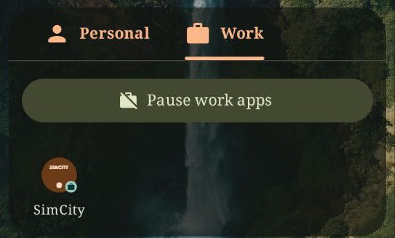
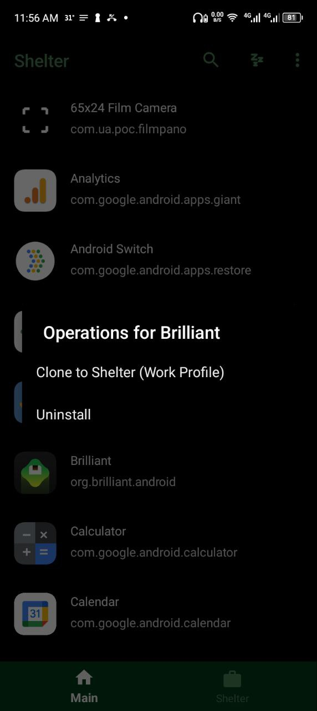
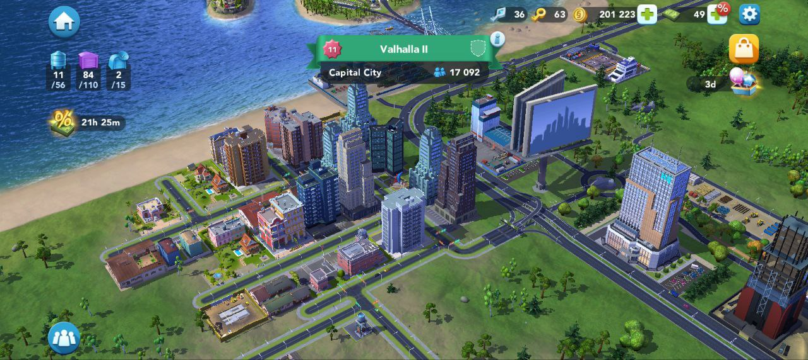

---

## The Problem That Started Everything

It began with SimCity BuildIt. Like many players, I wanted to run a feeder city, a secondary city that exists solely to supply resources to your main city. This is a common strategy that significantly improves your gameplay experience. The challenge? Android kept loading the same game progress regardless of which Google Play account I used.

The issue was straightforward: SimCity BuildIt ties game data to your Google Play Games account. Once I logged in with my account, the game was locked to that city's progress. Switching Google accounts wouldn't help because I didn't have a second city yet—I only had my main city. The game would either load my existing progress or start fresh, that is if I cleared the app data and used a different account , but there was no way to maintain two separate cities simultaneously on the same device under the same account structure.

## The Dead Ends

My first thought was simple: clear the app data and load the game with a different Google Play account. This seemed practical until I realized how impractical it actually was. Every time I wanted to switch cities, I would need to:

1. Clear app data
2. Change the account settings for the game in google play
3. Reload the game
4. Reverse the entire process to switch back

This idea wasn't sustainable for a game I played multiple times daily.

Then I remembered Parallel Space—an app I had used before that created cloned instances of apps. It seemed like the perfect solution until I started researching current user experiences. The concerns were numerous:

- **Heavy battery drain** from running duplicate app environments
- **High RAM usage** that slowed down the entire device
- **Aggressive ads** interrupting the experience
- **Tracking concerns** about what data the app collected
- **App compatibility issues** with newer Android versions
- **Unreliable notifications** that would arrive late or not at all

> [!warning] Third-Party App Cloners While apps like Parallel Space offer convenience, they often come with significant trade-offs in performance, privacy, and security. They operate at a high privilege level to clone apps, which can introduce vulnerabilities.

The more I researched, the clearer it became that this wasn't the path forward. I needed something more stable, more secure, and ideally something that didn't require purchasing another device.

## The Discovery

After scouring forums and Reddit threads, someone mentioned using two phones—one for each city. While that would certainly work, buying another phone just to play a mobile game seemed excessive. Further research led me to Shelter, an open-source Android app available on F-Droid. Unlike Parallel Space or similar cloning apps, Shelter doesn't actually clone anything. Instead, it leverages Android's built-in managed profile feature to create a legitimate work profile—the same technology that enterprise device management solutions use. I had never heard of work profiles before and  I had never considered using one for personal purposes.

> [!info] About Shelter: Shelter is an open-source app that provides a user-friendly interface for creating and managing Android work profiles without requiring corporate MDM (Mobile Device Management) infrastructure. It's available on F-Droid and GitHub.

## Understanding Work Profiles

Work profiles have been part of Android since version 5.0 (Lollipop), released in 2014. They're built into the Android operating system itself, not bolted on by third-party apps. Here's what makes them different:

### System-Level Isolation

A work profile creates a completely separate environment on your device. This isn't virtualization or sandboxing in the traditional sense—it's a distinct user profile with its own:

- **App storage**: Apps installed in the work profile have their own data directories
- **Accounts**: Google accounts and other services are separate between profiles
- **Permissions**: Apps in the work profile request permissions independently
- **Encryption**: Work profile data can be encrypted separately from personal data
- **Notifications**: Each profile maintains its own notification channels

### How It Works Technically

Android's work profile implementation uses the Android user management system. When you create a work profile, Android creates a new user space (similar to how multiple users work on a desktop operating system) but with some key differences:

1. **Profile Owner**: The work profile has an admin app (like Shelter) that acts as the "profile owner"
2. **Managed Apps**: Apps installed in the work profile are managed independently
3. **Cross-Profile Communication**: Android controls what data can move between profiles
4. **Resource Sharing**: Both profiles share the same hardware resources but maintain logical separation

This architecture means that an app running in your work profile genuinely believes it's on a different device. It has no access to your main profile's data, and vice versa.

## Setting Up Shelter

Installing Shelter was straightforward. After downloading the apk file from the gihub page, the setup process walked me through creating a work profile. The app requests Device Administrator privileges—which might sound alarming, but this is necessary for the managed profile feature to function. Unlike third-party cloners that use these permissions ambiguously, Shelter uses them exactly as Android intends for work profile management.

Once the work profile was created, I noticed a new tab in my app drawer labelled "Work" This is where all apps installed within the work profile appear. They're visually identical to their main profile counterparts but marked with a small briefcase icon to indicate they're work apps.

I installed SimCity BuildIt from the Google Play Store inside the shelter app while in the work profile. When I launched it, the game behaved exactly as if it were running on a fresh device—no existing progress, no saved data, ready to start a new city from scratch.

## The Results

The solution worked perfectly. I now had two completely separate instances of SimCity BuildIt:

1. **Main Profile**: My primary city with months of progress
2. **Work Profile**: A fresh feeder city optimized for resource production

Switching between them was as simple as switching between the Phone app and the Calculator app. No account switching, no data clearing, no complicated workarounds. Each city maintained its own progress, its own Google Play Games connection, and its own in-game purchases.

### Performance Considerations

Unlike app cloners, the work profile implementation had minimal impact on performance:

- **Battery drain** was negligible—only the active profile's apps consume resources
- **RAM usage** was efficient—inactive profile apps don't stay in memory
- **Storage** only increased by the size of the second app installation
- **Notifications** worked reliably for both profiles
- **System stability** remained unchanged

## Beyond Gaming: Real Use Cases

This experiment with SimCity BuildIt revealed something more significant: work profiles are a remarkably versatile tool that most Android users never explore. Here are legitimate use cases beyond gaming:

### Privacy and Security

- **App Isolation**: Test suspicious apps in the work profile without risking your main profile data
- **Account Separation**: Keep personal and professional social media accounts completely separate
- **Data Containment**: Prevent apps from accessing your main profile's contacts, photos, or files

### Multiple Accounts

- **Messaging Apps**: Run WhatsApp, Telegram, or Signal with different phone numbers
- **Social Media**: Maintain separate Instagram, Twitter, or Facebook accounts without logging in and out
- **Email Management**: Keep work email in the work profile, personal email in the main profile

### Development and Testing

- **App Testing**: Test apps in a clean environment without affecting your main setup
- **Different Configurations**: Run different versions of the same app with different settings
- **Bug Reproduction**: Isolate issues without compromising your primary device environment

> [!tip] Pro Tip You can pause the work profile when you're not using it. This completely freezes all apps in that profile, preventing them from running in the background and consuming resources.

## The Technical Deep Dive

For those interested in the underlying technology, work profiles operate through Android's managed provisioning system. Here's what happens when you create one:

### Managed Profile Creation

1. **Profile Owner App**: Shelter (or any similar app) requests to become the "Profile Owner"
2. **System Validation**: Android verifies the request and creates a new user profile
3. **Policy Enforcement**: The Profile Owner can now enforce policies within that profile
4. **App Installation**: Apps installed in this profile are tagged as "managed"

### Communication Channels

Android does provide controlled ways for profiles to interact:

- **Intent Forwarding**: Certain intents can be forwarded between profiles (like sharing files)
- **Cross-Profile Contacts**: If enabled, you can see contacts from both profiles
- **Cross-Profile Calendar**: Calendar events can be shared between profiles

These features are opt-in and controlled by the Profile Owner app, giving you granular control over what crosses profile boundaries.

## Limitations and Considerations

Work profiles aren't perfect. Here are some limitations to be aware of:

### Hardware and System Limitations

- **Single Device**: You can only have one work profile per device
- **Storage**: Each profile maintains separate app installations, effectively doubling storage use
- **Notifications**: Managing notifications from two profiles can become cluttered
- **Android Version**: Older Android versions have more limited work profile features

### App-Specific Issues

- **Banking Apps**: Some banking apps detect work profiles and refuse to run in them
- **DRM Content**: Certain streaming services may not work properly in work profiles
- **Root Detection**: Some apps may flag the work profile environment as suspicious

> [!note] Compatibility While most apps work flawlessly in work profiles, some apps with aggressive security measures may refuse to run. This is relatively rare but worth testing with critical apps before fully committing to a work profile setup.

## Resources and Further Reading

If you want to explore work profiles in depth, these resources provide comprehensive technical documentation:

### Official Documentation

- [Android Enterprise: Managed Profiles](https://developer.android.com/work/managed-profiles)
- [Google: Work Profiles Guide](https://support.google.com/work/android/answer/6191949)

### Shelter

- [Shelter on GitHub](https://github.com/PeterCxy/Shelter)
- [Shelter on F-Droid](https://f-droid.org/packages/net.typeblog.shelter/)

## Conclusion

What began as a search for a way to run two cities in a mobile game turned into a discovery of one of Android's most underutilized features. Work profiles are elegant, secure, and remarkably powerful. They solve problems that users typically address with hacky solutions or third-party apps that compromise security and performance.

The beauty of work profiles is that they're not a workaround—they're a feature. Android designed them to coexist on a single device, and the operating system handles all the complexity of keeping them separate. No virtual machines, no app cloning, no security concerns. Just native Android functionality working exactly as intended.

If you've never experimented with a work profile, it's worth trying. Whether you're a gamer looking for multiple accounts, a developer needing clean test environments, or someone who values privacy and data separation, work profiles offer a solution that's already built into your device.
