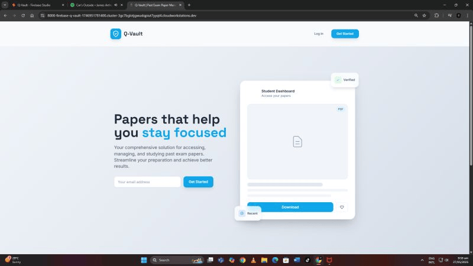
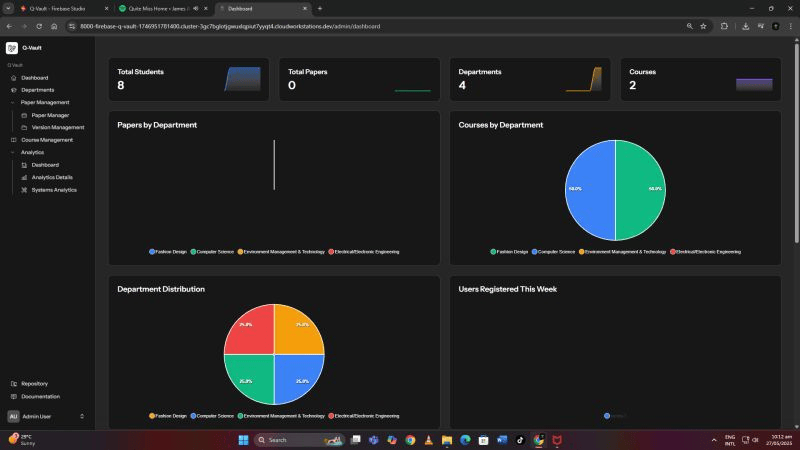
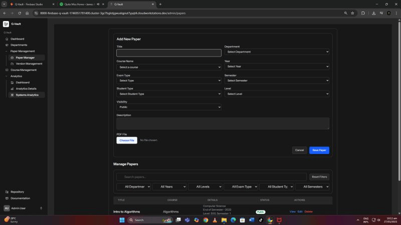

<em>Q-Vault landing page</em>
# Q-Vault – Past Exam Paper Management System

## Project Overview

Q-Vault is a Laravel + Livewire system built to bring order to the chaos of past exam paper storage. The traditional approach relied on bulky, bound booklets containing years of mixed papers across levels and student types. Students had to sift through hundreds of pages just to find a single semester’s paper. Q-Vault replaces that disorder with a clean, categorized digital archive where every exam paper is uploaded, tagged, and instantly searchable. It was built out of necessity, shaped by first-hand experience dealing with an inefficient system, and designed to make academic access straightforward for both librarians and students.

## Key Features

### Role-Based Access

- **Super Admin:** Full system control, user management, system settings, report resolution
    
- **Admin:** Upload and manage papers, view student reports, export data
    
- **Student:** Search, filter, and download past papers
    

### Paper Management

- Upload scanned PDFs with structured fields: title, year, semester, student type (HND, BTECH, TOP-UP, RESIT, MTECH), department, and course
    
- Organized storage using Laravel’s file system
    
- Bulk exports via Excel or PDF
    

<em>Main admin dashboard page</em>
### Search & Filtering

- Keyword search across course names and departments
    
- Filters for year, student type, semester, and department
    
- Instant results without forcing refinement filters
    

### Department & Course Structure

- Departments and courses follow the official academic structure
    
- No ad-hoc entries; everything aligns with established faculty organization
    

### Reports & Feedback

- Students can submit bugs, feature requests, or general comments
    
- Admins can mark reports as resolved or unresolved
    
- Categories and statuses are visible on the admin dashboard
    

### Analytics Dashboard

- Total students, papers, and downloads
    
- Login stats and failed login attempts
    
- Storage health and capacity overview
    
- System checks for database and storage status
    
- High-level snapshot of system activity and performance
     <em>Q-Vault paper upload page</em>
## Technical Implementation

Q-Vault is powered by Laravel 10 with Livewire 3 across both admin and student interfaces for a reactive but server-driven experience. Alpine.js handles light interactivity, while Tailwind CSS keeps the UI clean and consistent. MySQL powers production-grade storage, with SQLite used during development. Core packages include Spatie Permissions for access control, Laravel Excel for data import/export, and Laravel Telescope for local monitoring. PDF handling and secure storage are managed through Laravel’s filesystem layer.

## Use Cases

- **Libraries & Academic Offices:** Replace manual booklet systems with structured digital access
    
- **Students:** Quickly find the exact paper for their course, year, or program
    
- **Admins:** Keep an organized archive with reliable uploads and usage insights
    
- **Institutions:** Provide accessible academic resources without building a full LMS
    

## Installation & Setup

**Requirements:**

- PHP 8.2+
    
- Composer 2.5+
    
- Node.js 18+
    
- MySQL 8.0+ or SQLite for development
    

The system runs locally today, previously exposed briefly through ngrok for testing. A migration toward hosting on Supabase for database storage was the final development step.

## Project Status

Q-Vault is feature-complete and stable. The system was designed to handle thousands of papers with predictable performance, and while it isn’t deployed publicly yet due to hosting costs, the full codebase, structure, and workflow are complete. Built to solve a real problem, it stands as a reliable archive system that brings order, speed, and clarity to exam paper retrieval.